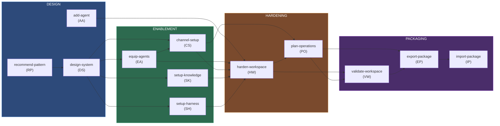
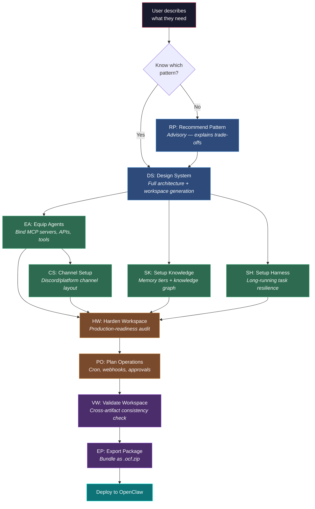
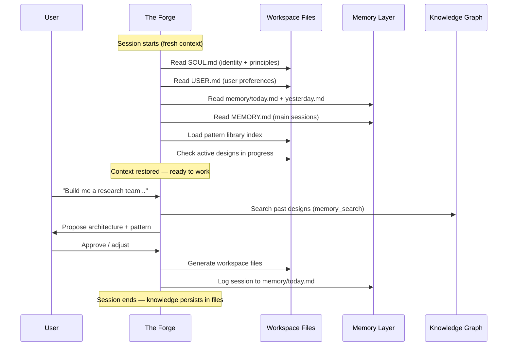
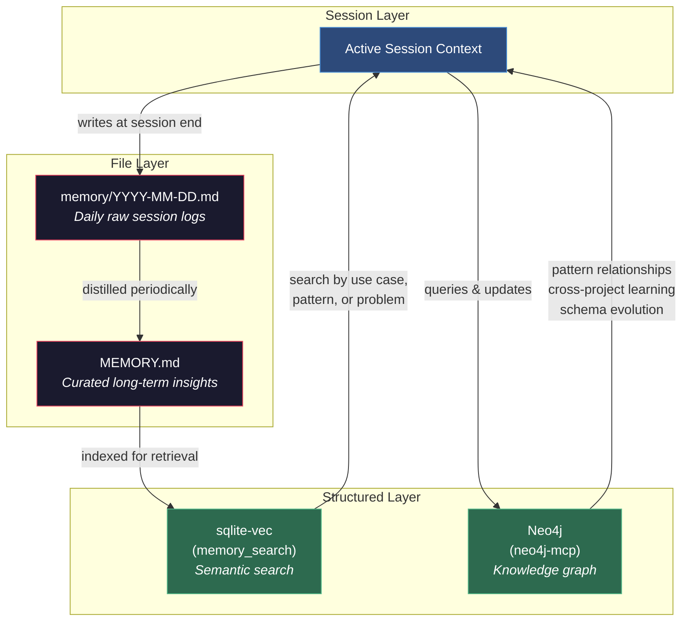
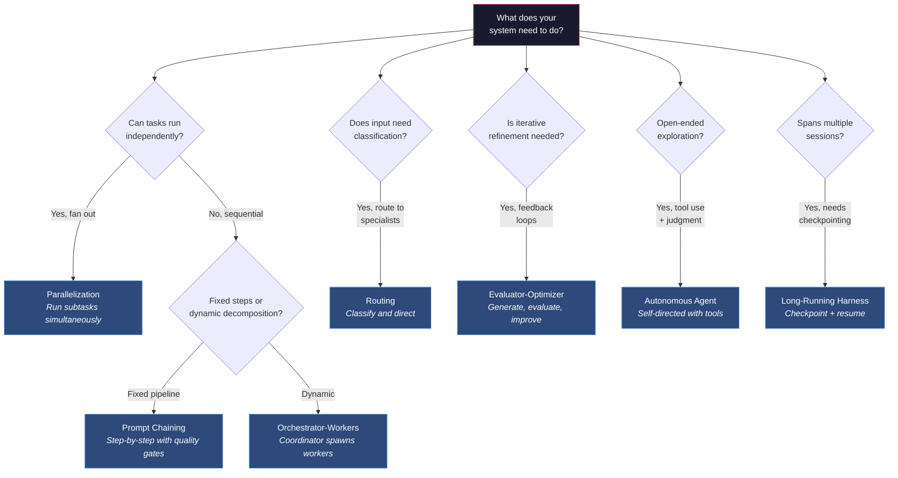

# The Forge — User Guide

> **"Where they were many, I am one. Where they worked in turns, I work as a whole."**

The Forge is a meta-agent that designs, builds, configures, and deploys multi-agent AI systems on [OpenClaw](https://github.com/open-claw). You describe what you need in natural language — The Forge selects the right agentic pattern, designs your agent team, generates production-ready configuration, and guides deployment. No config files to edit. No architecture decisions to agonize over.

---

## Table of Contents

- [Quick Start](#quick-start)
- [How It Works](#how-it-works)
- [Skills Reference](#skills-reference)
- [Workspace Files](#workspace-files)
- [Agentic Patterns](#agentic-patterns)
- [Examples](#examples)
- [Build Artifacts](#build-artifacts)
- [Troubleshooting](#troubleshooting)

---

## Quick Start

### 1. Install

```bash
bmad install forge
```

### 2. Talk to The Forge

Open your preferred channel (Discord, Telegram, WhatsApp, or TUI) and describe the system you want to build:

```text
"I want a customer support system with a triage agent and three specialists
for billing, technical issues, and general inquiries."
```

### 3. The Forge takes it from there

It will:
1. Analyze your use case
2. Recommend the right agentic pattern (Routing, in this case)
3. Design your agent roster
4. Generate all workspace files and configuration
5. Validate everything
6. Guide you through deployment

You review and approve at each step. The Forge builds; you decide.

---

## How It Works

The Forge covers the full lifecycle of a multi-agent system through **12 skills** organized into four phases:



Each skill is a focused capability. You can run them individually or let The Forge chain them together as part of a full system build.

### Session Model

The Forge wakes up fresh each session. It reads its workspace files (SOUL.md, USER.md, recent memory) to restore context. What it learns gets written to memory files so future sessions can pick up where it left off.

### Interaction Model

Every skill follows the same pattern:
1. The Forge analyzes your current state
2. It proposes a plan with rationale
3. You review, adjust, and approve
4. The Forge executes and validates
5. It offers the natural next step

Nothing gets deployed without your sign-off.

### End-to-End Build Flow

A typical full system build follows this path from idea to deployed package:



> Not every step is required. You can enter at any point — `add-agent` into an existing system, `harden-workspace` on an already-working setup, or `validate-workspace` as a standalone health check.

### Session Model

The Forge wakes up fresh each session. It reads its workspace files (SOUL.md, USER.md, recent memory) to restore context. What it learns gets written to memory files so future sessions can pick up where it left off.

### Interaction Model

Every skill follows the same pattern:
1. The Forge analyzes your current state
2. It proposes a plan with rationale
3. You review, adjust, and approve
4. The Forge executes and validates
5. It offers the natural next step

Nothing gets deployed without your sign-off.

---

## Skills Reference

Each skill has a two-letter trigger code. You can invoke skills by trigger or by describing what you need — The Forge recognizes natural language.

### Design Phase

#### `recommend-pattern` (RP) — Advisory

Analyzes your use case and recommends the best agentic pattern. Advisory only — no files generated.

**When to use:** You have an idea but aren't sure what architecture fits.

**What you get:** Ranked pattern recommendations with trade-off analysis and a conceptual preview of how the system would look in OpenClaw.

**Leads to:** `design-system`

---

#### `design-system` (DS) — Full Build

End-to-end multi-agent system creation. Goes from a natural language description to a complete, deployable OpenClaw workspace.

**When to use:** You're ready to build a new multi-agent system from scratch.

**What you get:**
- Agentic pattern selection with rationale
- Complete agent roster with roles and responsibilities
- Workspace files for every agent (SOUL.md, AGENTS.md, etc.)
- `openclaw.json` configuration with bindings, model config, and tool policies
- Validation report and deployment guidance

**Execution flow:**
1. Analyze use case (domain, scale, interaction model)
2. Select pattern (from the 7 proven agentic patterns)
3. Design agent roster (roles, capabilities, relationships)
4. Generate workspace files for each agent
5. Generate `openclaw.json` with all wiring
6. Validate the complete system
7. Offer follow-on skills (equip tools, set up channels, harden)

**Leads to:** `equip-agents`, `channel-setup`, `setup-knowledge`, `setup-harness`, `harden-workspace`

---

#### `add-agent` (AA) — Extend Existing System

Safely adds one new agent to an existing workspace without breaking what's already running. Reads your existing workspace, gathers requirements, generates workspace artifacts, merges config, and validates the extended system.

**What you get:** New agent workspace files, merged configuration, and a validation report.

**Leads to:** `harden-workspace`, `validate-workspace`

---

### Enablement Phase

#### `equip-agents` (EA) — Tool Binding

Turns capability statements ("this agent needs to search the web") into concrete tool bindings — MCP servers, APIs, and custom tools.

**When to use:** After designing your system, when agents need real tools to do their work.

**What you get:** Agent-to-tool mapping matrix, MCP server and API scaffold configurations, environment checklist (API keys, connection strings), and tool policy suggestions.

**Leads to:** `harden-workspace`, `setup-knowledge`

---

#### `channel-setup` (CS) — Communication Channels

Designs the communication topology for your agent system. Maps each agent to a dedicated channel with categories, naming conventions, and per-channel welcome content. Currently supports Discord.

**What you get:** Categorized channel layout, per-channel configuration, welcome messages in each agent's voice, setup checklist, and an optional automation script.

**Leads to:** `harden-workspace`, `plan-operations`

---

#### `setup-knowledge` (SK) — Memory Architecture

Designs and configures the memory and knowledge architecture for your agent system.

**Memory tiers:**

| Tier | Backend | Best For |
|------|---------|----------|
| Flat-file | `memory/` + `memory_search` (sqlite-vec) | Session logs, simple recall |
| Vector | sqlite-vec / memory_search | Semantic search across past interactions |
| Graph | Neo4j (neo4j-mcp) | Relationship mapping, cross-project patterns |

**What you get:** Memory tier recommendation, backend configuration, capture/recall hooks, and end-to-end verification.

**Leads to:** `harden-workspace`, `validate-workspace`

---

#### `setup-harness` (SH) — Long-Running Resilience

Configures your agents for long-duration tasks that span multiple sessions — checkpointing, heartbeat cadence, session bridging, and resume behavior.

**What you get:** Heartbeat and compaction settings, progress tracking configuration, session bridging setup, and recovery path verification.

**Leads to:** `harden-workspace`, `validate-workspace`

---

### Hardening & Operations

#### `harden-workspace` (HW) — Production Hardening

Systematic production-readiness audit and remediation across six dimensions:

| Dimension | What Gets Checked |
|-----------|------------------|
| Memory | Config completeness, retention policies, backup |
| Tool Policies | Least-privilege access, approval gates, safe binary lists |
| Model Failover | Primary + fallback models, timeout config |
| Observability | Heartbeat monitoring, logging, health checks |
| Self-Correction | AGENTS.md guardrails, error recovery instructions |
| Boundaries | SOUL.md constraints, sandbox restrictions |

**What you get:** Before/after comparison with severity-graded findings, applied fixes, and a hardening report.

**Leads to:** `plan-operations`, `validate-workspace`

---

#### `plan-operations` (PO) — Execution Modes

Configures how each agent runs — manually, on a schedule, via webhooks, or with human approval gates.

| Mode | Fits | OpenClaw Config |
|------|------|----------------|
| Manual | Direct user requests, creative tasks | Channel bindings (default) |
| Cron/Heartbeat | Monitoring, periodic reports, data sync | `cron.enabled`, `heartbeat` settings |
| Webhook | PR reviews, deployment triggers, form submissions | `hooks.enabled`, `hooks.mappings` |
| Human-in-the-loop | Deployments, data modifications, financial ops | `tools.exec.ask`, `tools.exec.safeBins` |

**What you get:** Per-agent execution mode classification, complete operations plan, and implemented config sections in `openclaw.json`.

**Leads to:** `validate-workspace`, `export-package`

---

### Validation & Packaging

#### `validate-workspace` (VW) — Cross-Artifact Validation

Read-only inspection of your entire workspace. Checks structural integrity, cross-reference consistency, hardening completeness, and inter-file coherence.

**What you get:** Categorized findings (CRITICAL / WARNING / INFO), pass/fail verdict, and remediation guidance.

---

#### `export-package` (EP) — Bundle for Sharing

Packages your workspace into a portable `.ocf.zip` file with provenance metadata and setup instructions.

**What you get:** A `.ocf.zip` containing workspace files, skills, config, a `manifest.ocf.json` with version and compatibility info, and a setup prompt for first-run initialization.

---

#### `import-package` (IP) — Install Package

Installs an `.ocf.zip` package into an OpenClaw instance with conflict-aware merging.

**What you get:** Installed workspace files, merged configuration (with conflict resolution), integrity verification report, and import event log.

---

## Workspace Files

When The Forge is deployed into OpenClaw, it uses these workspace files:

| File | Purpose | Who Maintains It |
|------|---------| ------------------|
| `SOUL.md` | Personality, principles, boundaries, voice | The Forge evolves it over time |
| `IDENTITY.md` | Identity card — name, creature type, vibe, emoji | Mostly static |
| `AGENTS.md` | Operational playbook — session startup, memory model, tools, safety rules | The Forge adds conventions |
| `TOOLS.md` | MCP server connections and tool-specific operational notes | The Forge fills in at runtime |
| `HEARTBEAT.md` | Proactive check items for heartbeat polls | The Forge updates as needed |
| `USER.md` | Your preferences — communication style, experience level, autonomy settings | You and The Forge together |

### How Sessions Work

Every time The Forge starts a session:

1. Reads `SOUL.md` — remembers who it is
2. Reads `USER.md` — remembers who you are
3. Reads recent `memory/YYYY-MM-DD.md` files — picks up recent context
4. Reads `MEMORY.md` (in main sessions) — loads curated long-term knowledge
5. Loads the pattern library index
6. Checks for active designs in progress



This happens automatically. You just start talking.

### Memory Model

The Forge uses a layered memory system:



- **Daily notes** (`memory/YYYY-MM-DD.md`) — Raw session logs. What happened, what was decided, what patterns were applied.
- **Long-term memory** (`MEMORY.md`) — Curated insights distilled from daily notes. Cross-project lessons, pattern effectiveness ratings, architectural decisions.
- **Knowledge graph** (Neo4j via neo4j-mcp) — Structured relationships: which patterns compose well, what configurations have been validated, how the schema has evolved.

---

## Agentic Patterns

The Forge selects from seven proven patterns based on your use case:



| Pattern | Best For | Example |
|---------|----------|---------|
| **Prompt Chaining** | Sequential processing with quality gates | Content pipeline: draft, edit, fact-check, publish |
| **Routing** | Classifying inputs and directing to specialists | Support system: triage agent routes to billing/tech/general |
| **Parallelization** | Independent subtasks that can run simultaneously | Research: investigate multiple topics at once |
| **Orchestrator-Workers** | Complex tasks with dynamic subtask decomposition | Project manager spawning specialist investigators |
| **Evaluator-Optimizer** | Iterative refinement with quality feedback loops | Code review: write, review, improve, approve |
| **Autonomous Agent** | Open-ended tasks requiring tool use and judgment | Research assistant exploring a topic independently |
| **Long-Running Harness** | Tasks spanning multiple sessions with checkpointing | Multi-day research with progress tracking |

The Forge explains why a pattern fits your use case, what the trade-offs are, and what the OpenClaw implementation looks like.

---

## Examples

### Customer Support System (Routing)

**You:** "I want a customer support system with a triage agent and three specialists."

**The Forge:** Recommends Routing pattern. Designs 4 agents (Triage Router, Billing/Technical/General Specialists). Generates workspace files and `openclaw.json` with bindings. Offers follow-on: `equip-agents` (bind CRM tools), `channel-setup` (Discord channels), `setup-knowledge` (customer memory).

### Research Team (Orchestrator-Workers)

**You:** "I need a research team that can break down complex topics, investigate in parallel, and synthesize findings."

**The Forge:** Recommends Orchestrator-Workers pattern. Designs Research Coordinator + Topic Investigators (spawned dynamically via `sessions_spawn`). Sets up knowledge graph and long-running harness for multi-session research.

### Adding an Agent to an Existing System

**You:** "Add a fact-checker agent that reviews everything before it goes to the user."

**The Forge:** Reads existing workspace, designs the new agent as an Evaluator-Optimizer gate, generates workspace files, merges config preserving existing setup, and validates the extended system.

---

## Build Artifacts

The Forge Builder (Morgan) generates everything in `dist/`. Do not edit these files by hand.

```text
dist/
├── workspace/              # OpenClaw workspace files for The Forge
│   ├── SOUL.md
│   ├── IDENTITY.md
│   ├── AGENTS.md
│   ├── TOOLS.md
│   ├── HEARTBEAT.md
│   └── USER.md
│
├── skills/                 # Skill definitions (one SKILL.md per capability)
│   ├── design-system/          DS
│   ├── add-agent/              AA
│   ├── recommend-pattern/      RP
│   ├── equip-agents/           EA
│   ├── channel-setup/          CS
│   ├── setup-knowledge/        SK
│   ├── setup-harness/          SH
│   ├── harden-workspace/       HW
│   ├── plan-operations/        PO
│   ├── validate-workspace/     VW
│   ├── export-package/         EP
│   └── import-package/         IP
│
├── *.ocf.zip               # Packaged releases
├── RELEASE.md              # Release notes
├── skill-build-context.md  # Build context from last skill generation
└── add-skill-context.md    # Build context from last add-skill run
```

### How Artifacts Are Generated

| Artifact | Workflow | Agent |
|----------|----------|-------|
| `workspace/*` | `build-forge-agent` | Morgan (Forge Builder) |
| `skills/*/SKILL.md` | `build-forge-skill` | Morgan (Forge Builder) |
| `*.ocf.zip` | `package-forge` | Morgan (Forge Builder) |

### Deployment

**Option A — Manual:**
Copy `workspace/` files to your OpenClaw workspace root and `skills/` to the skills directory.

**Option B — Package:**
Use a `.ocf.zip` release with the `import-package` skill for automated installation with conflict-aware merging.

---

## Troubleshooting

### "The Forge doesn't recognize my existing workspace"
- Ensure your OpenClaw workspace has a valid `openclaw.json` at the root
- Check that workspace files are in expected locations

### "Generated config has validation errors"
- Ask The Forge to update its reference data (this triggers the builder's `update-reference-data` workflow)
- Then regenerate the config

### "Knowledge graph setup fails"
- Verify MCP server connectivity (neo4j-mcp or memory server)
- Check that the MCP server is available in your OpenClaw instance

### "I'm not sure which skill to use"
- Start with `recommend-pattern` (RP) if you're unsure about architecture
- Use `validate-workspace` (VW) after any changes to catch inconsistencies
- Use `harden-workspace` (HW) before going to production

### Tips

- **Export frequently** — `export-package` creates snapshots you can roll back to
- **Knowledge compounds** — the more your agents interact, the smarter The Forge's recommendations become
- **Let The Forge chain** — after `design-system`, it will naturally suggest `equip-agents`, then `channel-setup`, then `harden-workspace`. Follow the flow.
- **Review, don't rubber-stamp** — The Forge presents everything for your approval. Take the time to understand what it's generating.
